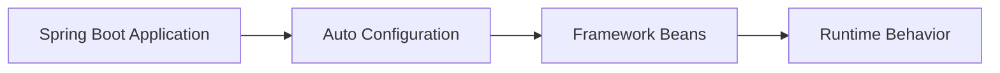

# Redis Listener Auto Configuration

> Module: `modules/05-redis-listener`

## Introduction

Spring Boot 4.1 improves Redis listener auto-configuration to reduce manual wiring.

## Objective

The objective is to show how Redis Listener Auto Configuration solves a real engineering problem, not just how to enable it.

## Purpose

This feature exists because production systems often expose limitations in older configuration or manual wiring patterns.

## Expectations

Expect better consistency, lower operational friction, or safer defaults depending on the feature. Do not expect it to replace good architecture, testing, or production monitoring.

## Existing Solution

Before this feature, teams usually relied on manual configuration, lower-level Spring Framework APIs, or third-party integration patterns.

## Existing Limitations

Existing approaches could work, but often required repetitive boilerplate, deeper framework knowledge, or inconsistent project-level decisions.

## Why This Feature Exists

Spring Boot evolves by turning common production patterns into well-supported auto-configuration and safer defaults.

## Engineering Story

This section should be expanded with production scenarios, diagrams, and measured examples as the repository evolves.

## Design Philosophy

This section should be expanded with production scenarios, diagrams, and measured examples as the repository evolves.

## Internal Architecture

## Code Examples

See `modules/05-redis-listener` for runnable code.

## Demo

This section should be expanded with production scenarios, diagrams, and measured examples as the repository evolves.

## Production Use Cases

This section should be expanded with production scenarios, diagrams, and measured examples as the repository evolves.

## Performance Considerations

This section should be expanded with production scenarios, diagrams, and measured examples as the repository evolves.

## Security Considerations

This section should be expanded with production scenarios, diagrams, and measured examples as the repository evolves.

## Advantages

This section should be expanded with production scenarios, diagrams, and measured examples as the repository evolves.

## Limitations

This section should be expanded with production scenarios, diagrams, and measured examples as the repository evolves.

## When NOT to Use

This section should be expanded with production scenarios, diagrams, and measured examples as the repository evolves.

## Best Practices

This section should be expanded with production scenarios, diagrams, and measured examples as the repository evolves.

## Summary

This section should be expanded with production scenarios, diagrams, and measured examples as the repository evolves.

## References

- Spring Boot 4.1 Release Notes
- Spring Boot Reference Documentation

