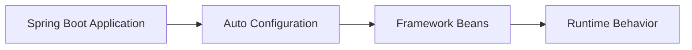

# HTTP Client SSRF Mitigation

> Module: `modules/03-http-client-ssrf-mitigation`

## บทนำ

ช่วยลดความเสี่ยง SSRF เมื่อระบบต้องยิง HTTP ไปยัง URL ที่อาจมาจาก User หรือ External Source

## Objective

เป้าหมายคืออธิบายว่า HTTP Client SSRF Mitigation แก้ปัญหาเชิงวิศวกรรมอะไร ไม่ใช่แค่เปิดใช้งานอย่างไร

## Purpose

Feature นี้เกิดขึ้นเพราะในระบบ Production ของเดิมอาจใช้ได้ แต่ยังมี Pain Point เรื่อง Boilerplate, ความซับซ้อน, ความปลอดภัย หรือการดูแลระบบ

## Expectations

สิ่งที่ควรคาดหวังคือความชัดเจน ความปลอดภัย หรือความง่ายในการดูแลระบบมากขึ้น แต่ไม่ควรคาดหวังว่า Feature จะมาแทนการออกแบบระบบที่ดี การทดสอบ หรือ Monitoring

## Existing Solution

ก่อนมี Feature นี้ ทีมมักใช้ Manual Configuration, API ระดับล่างของ Spring Framework หรือ Third-party Pattern

## Existing Limitations

ของเดิมใช้ได้ แต่หลายครั้งต้องเขียนซ้ำ เข้าใจลึก หรือแต่ละทีมทำไม่เหมือนกัน ทำให้ Maintain ยาก

## Why This Feature Exists

Spring Boot มักนำ Pattern ที่เจอบ่อยใน Production มาทำเป็น Auto Configuration หรือ Default ที่ปลอดภัยและดูแลง่ายขึ้น

## Engineering Story

ส่วนนี้สามารถขยายเพิ่มด้วย Use Case จริง Diagram และผลการทดลองเมื่อ Repository เติบโตขึ้น

## Design Philosophy

ส่วนนี้สามารถขยายเพิ่มด้วย Use Case จริง Diagram และผลการทดลองเมื่อ Repository เติบโตขึ้น

## Internal Architecture

## Code Examples

ดู Code ตัวอย่างได้ที่ `modules/03-http-client-ssrf-mitigation`

## Demo

ส่วนนี้สามารถขยายเพิ่มด้วย Use Case จริง Diagram และผลการทดลองเมื่อ Repository เติบโตขึ้น

## Production Use Cases

ส่วนนี้สามารถขยายเพิ่มด้วย Use Case จริง Diagram และผลการทดลองเมื่อ Repository เติบโตขึ้น

## Performance Considerations

ส่วนนี้สามารถขยายเพิ่มด้วย Use Case จริง Diagram และผลการทดลองเมื่อ Repository เติบโตขึ้น

## Security Considerations

ส่วนนี้สามารถขยายเพิ่มด้วย Use Case จริง Diagram และผลการทดลองเมื่อ Repository เติบโตขึ้น

## Advantages

ส่วนนี้สามารถขยายเพิ่มด้วย Use Case จริง Diagram และผลการทดลองเมื่อ Repository เติบโตขึ้น

## Limitations

ส่วนนี้สามารถขยายเพิ่มด้วย Use Case จริง Diagram และผลการทดลองเมื่อ Repository เติบโตขึ้น

## When NOT to Use

ส่วนนี้สามารถขยายเพิ่มด้วย Use Case จริง Diagram และผลการทดลองเมื่อ Repository เติบโตขึ้น

## Best Practices

ส่วนนี้สามารถขยายเพิ่มด้วย Use Case จริง Diagram และผลการทดลองเมื่อ Repository เติบโตขึ้น

## Summary

ส่วนนี้สามารถขยายเพิ่มด้วย Use Case จริง Diagram และผลการทดลองเมื่อ Repository เติบโตขึ้น

## References

- Spring Boot 4.1 Release Notes
- Spring Boot Reference Documentation

